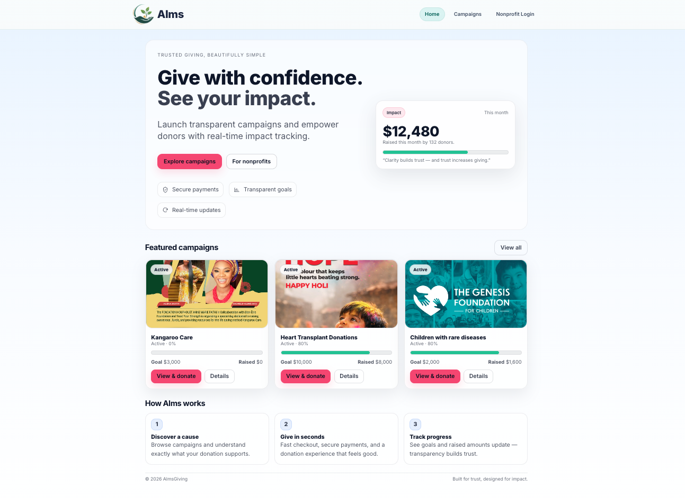
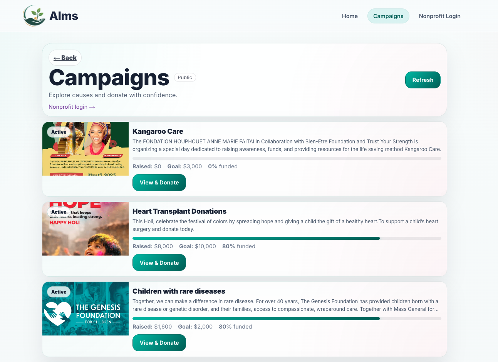
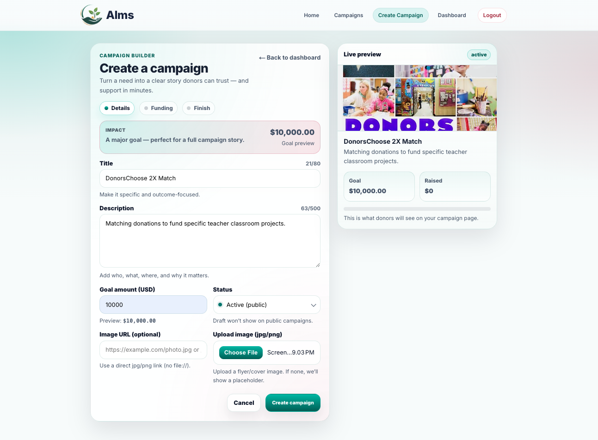
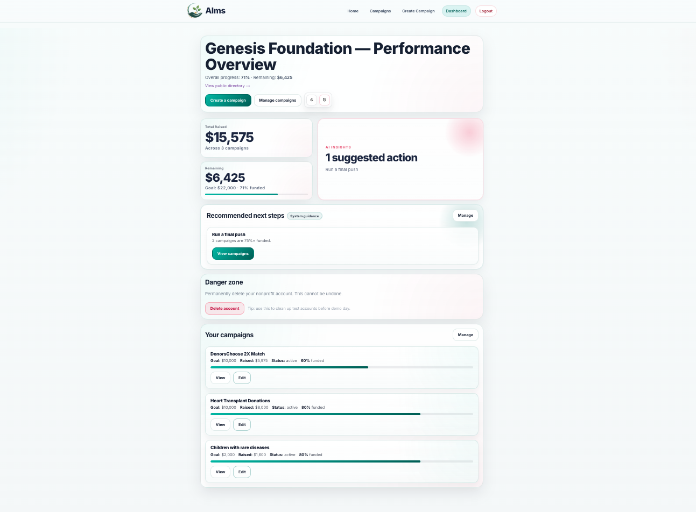
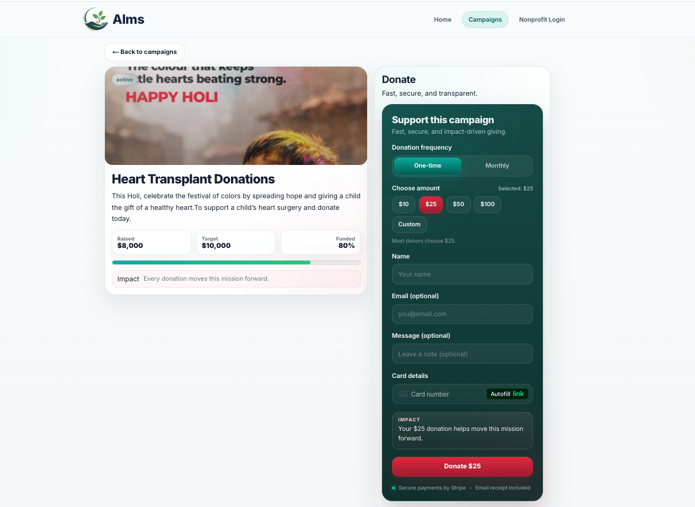

## Alms Lite — Nonprofit Fundraising Platform

Alms Lite is a full-stack fundraising platform that enables nonprofit organizations to create campaigns and securely accept online donations.

The platform provides:

* **Public campaign discovery** for donors to explore and support causes
* **Secure nonprofit dashboard** to create and manage fundraising campaigns
* **Stripe-powered donation processing** for safe and reliable payments
* **Automated email workflows** for donation receipts and password recovery

This project demonstrates a modern **full-stack architecture** built with:

**Next.js • React • Node.js • Express • MongoDB • Stripe • Resend**

It highlights secure authentication, campaign management, payment integration, and scalable API design.


## Key Highlights

- Full-stack architecture using **Next.js, Express, and MongoDB**
- Secure **JWT authentication** for nonprofit dashboards
- **Stripe Payment Intents API** integration for secure donations
- File uploads using **Multer** for campaign images
- RESTful API design with protected routes
- Deployment using **Render + MongoDB Atlas**

# Key Technical Concepts

- JWT authentication with protected routes
- Stripe Payment Intents API for secure payments
- RESTful API design
- Server-side file uploads using Multer
- MongoDB schema modeling with Mongoose
- Client/server separation using Next.js and Express

---

# Live Demo

Frontend  
https://almslite-frontend.onrender.com

Backend API  
https://almslite-backend.onrender.com

Example public campaigns page  
https://almslite-frontend.onrender.com/campaigns

---

# Features

### Donor Features

- Browse public fundraising campaigns
- View campaign details and progress
- Donate securely using Stripe
- Real-time funding progress display

### Nonprofit Features

- Secure authentication with JWT
- Create fundraising campaigns
- Edit campaign details and images
- Upload campaign images or use public image URLs
- Dashboard to manage campaigns

### Platform Features

- Stripe payment integration with webhook verification
- Automatic donation receipt emails via Resend
- Password reset email workflow
- MongoDB transactions for donation confirmation
- REST API backend
- Responsive UI
- Protected routes for nonprofit dashboard

### Email Features

- Password reset email flow using Resend
- Automatic donation receipts sent after successful Stripe payments

## Email System

Transactional emails are handled using **Resend**.

Two automated email workflows are implemented:

### Password Reset Emails

Users can request a password reset link.  
A secure token is generated and sent via email.

### Donation Receipts

After Stripe confirms a successful payment, a webhook triggers the backend to:

1. Verify the Stripe event
2. Confirm the donation in the database
3. Increment the campaign's raised amount
4. Send a receipt email to the donor

This ensures donation confirmation and receipts are processed **only after verified payment events**.

---

# Tech Stack

Frontend

- Next.js
- React
- CSS Modules
- Stripe.js

Backend

- Node.js
- Express
- MongoDB
- Mongoose
- Multer (image uploads)
- JWT authentication

Payments

- Stripe Payment Intents API

Deployment

- Render (frontend + backend)
- MongoDB Atlas (database)

---

# Architecture

```
Browser (Donor / Nonprofit)
        │
        ▼
Next.js Frontend (React)
        │
        ▼
Express API (Node.js)
        │
        ▼
MongoDB Atlas (Database)
```

Stripe Payment Flow

```
Browser → Backend → Stripe → Webhook → Database → Email Receipt
```

---

## Project Structure

```
almsgiving
│
├── frontend-next
│   ├── app
│   ├── components
│   ├── lib
│   ├── public
│   ├── package.json
│   └── next.config.ts
│
├── backend
│   ├── config
│   ├── middleware
│   ├── models
│   ├── routes
│   ├── utils
│   ├── uploads
│   ├── package.json
│   └── server.js
│
└── README.md
```

The project follows a monorepo structure separating the frontend and backend applications.

- **frontend-next/** contains the Next.js client application.
- **backend/** contains the Express API, database models, and Stripe webhook logic.
- Both services communicate through REST APIs.

---

# Database Schema

### Campaign

Campaign

.\_id

.nonprofitId

.title

.description

.goalAmount

.amountRaised

.imageUrl

.status

.createdAt

.updatedAt

### Nonprofit

Nonprofit

.\_id

.organizationName

.email

.passwordHash

.description

.createdAt

### Donation

Donation

.\_id

.campaignId

.donorName

.amount

.stripePaymentIntentId

.createdAt

---

# API Routes

## Authentication

POST /auth/register
POST /auth/login
POST /auth/forgot-password
POST /auth/reset-password

## Campaigns

GET /campaigns
GET /campaigns/:id

POST /campaigns
PATCH /campaigns/:id
DELETE /campaigns/:id

GET /campaigns/mine/list

## Donations

POST /donations/create-intent
POST /donations/confirm

## Webhooks

POST /webhooks/stripe

---

# Environment Variables

Backend `.env`

```env
MONGODB_URI=your_mongodb_connection
PORT=5050
JWT_SECRET=your_jwt_secret
STRIPE_SECRET_KEY=<your_stripe_secret_key>
STRIPE_WEBHOOK_SECRET=<your_stripe_webhook_secret>
CLIENT_URL=http://localhost:3000
FRONTEND_URL=https://almslite-frontend.onrender.com
RESEND_API_KEY=your_resend_key
FROM_EMAIL=<sender_email>
RECEIPT_TEST_EMAIL=<personal@gmail.com>
```

Frontend `.env`

```env
NEXT_PUBLIC_API_URL=http://localhost:5050
```

---

# Running the Project Locally

### 1. Clone the repository

git clone https://github.com/MianSeri/almslite.git

### 2. Install backend dependencies

cd backend
npm install

### 3. Install frontend dependencies

cd ../frontend-next
npm install

### 4. Start backend

cd backend
npm run dev

### 5. Start frontend

cd frontend-next
npm run dev

Frontend runs on

http://localhost:3000

Backend runs on

http://localhost:5050

---

# Deployment Notes

The application is deployed using Render free tier hosting.

Because free-tier servers spin down after inactivity, the backend may take a few seconds to wake up when the application is first accessed.

Campaign images support two methods:

1. File upload (stored on the server)
2. Public image URLs

Public image URLs are recommended for deployed demo campaigns because local file uploads on free hosting may not persist across redeploys.

---

# Future Improvements

Potential future improvements include:

- Persistent image storage (Cloudinary or AWS S3)
- Donation history dashboard for nonprofits
- Recurring donations / subscription giving
- Admin moderation tools
- Campaign categories and advanced search
- Multi-language support
- Analytics dashboard for nonprofits

---

## Screenshots

### Homepage


### Campaign Discovery


### Campaign Creation


### Nonprofit Dashboard


### Donation Flow


### Campaign Management


---

# Testing

Manual testing was performed for:

- Campaign creation
- Campaign editing
- Donation flow
- Stripe payment confirmation
- Authentication
- Dashboard access control

## Email Receipts (Development Mode)

Donation receipts are sent using **Resend**.

During development, Resend operates in **sandbox mode**, which restricts outgoing emails to the account owner's verified email address.

Because of this limitation, all donation receipts are temporarily routed to:

**mianbseri@gmail.com**

instead of the donor’s email address.

This allows the email workflow to be demonstrated during testing.

In a production environment this would be resolved by:

- Verifying a sending domain with Resend
- Updating the `FROM_EMAIL` address to a domain email (e.g., `donations@almslite.org`)
- Sending receipts directly to donor email addresses

---

## Deployment note

Campaigns support both uploaded images and public image URLs.

For deployed demo content, public image URLs are recommended because local file uploads on Render free hosting are not persistent across redeploys.

## Security Considerations

- Passwords are securely hashed using **bcrypt**
- Authentication is handled using **JWT tokens**
- Stripe webhook signatures are verified before processing events
- MongoDB transactions ensure donation confirmation and campaign updates remain consistent

# Author

Mian Seri

Software Engineer  
Springboard Software Engineering Program

GitHub  
https://github.com/MianSeri

---

# License

This project was built for educational purposes as part of the Springboard Software Engineering program.
